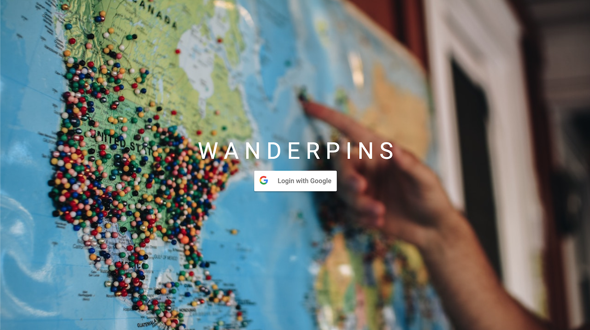
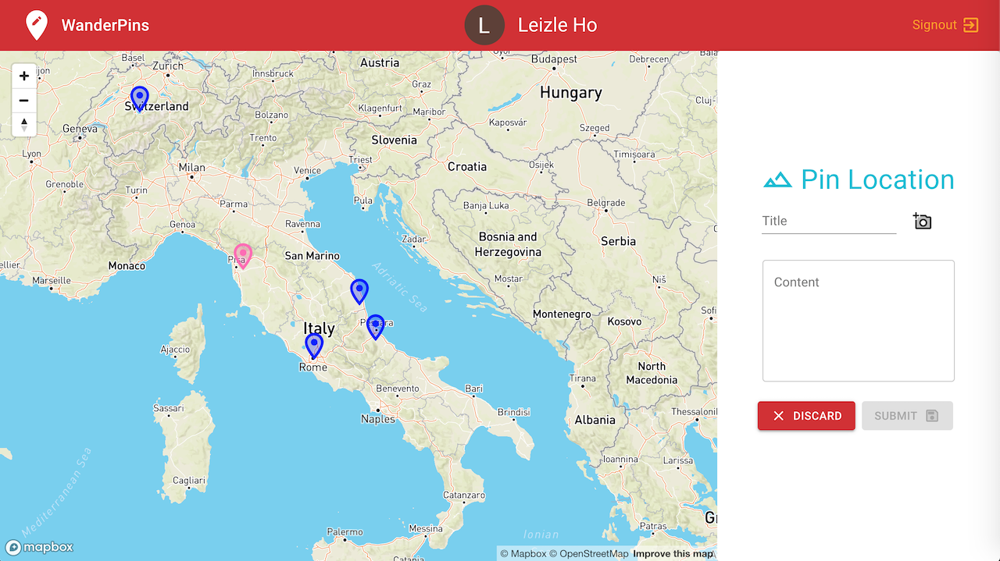

# W A N D E R P I N S

WanderPins is a full-stack React app featuring GraphQL subscription for realtime
 pinning of locations on the map. User can add their own content such as photo and notes about the pin. Users can add comment on their pin or on other users pins.

## Tech Stack
 - Node.js
 - Apollo Server 2
 - GraphQL
 - Google Oauth
 - MongoDB (mLab)
 - React Hooks (use for managing state which replaced Redux)
 - MapBox
 - Cloudinary (use for image management such us optimization and CDN)
 - Material-UI (use for styling)

### Landing Page

### Main Page Showing Map with Pins

### Adding new pin (with pink color pin on the map)
